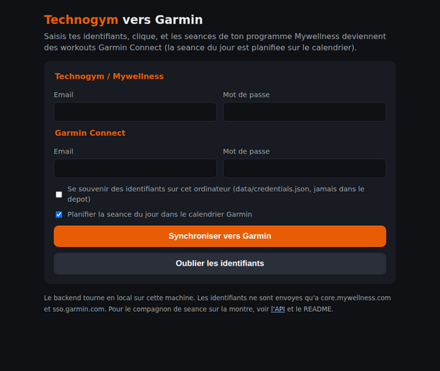
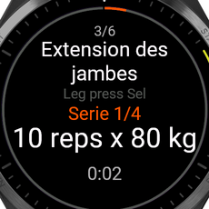
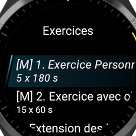

# Technogym (Mywellness) vers Garmin

Deux produits, un backend commun :

1. **Appli de synchro.** Tu lances le backend, une page web te demande tes identifiants Technogym et
   Garmin, tu cliques : chaque seance de ton programme Mywellness devient un workout structure Garmin
   Connect (exercices, series, charges, repos), la seance du jour est planifiee sur le calendrier. Un job
   peut refaire ce push chaque matin a 6h.
2. **Compagnon de seance sur la montre (app Connect IQ "Spotter for Technogym").** Seance du jour sur la montre,
   guidage serie par serie (cible reps / charge, repos avec vibration, blocs cardio a duree), activite FIT
   Strength. Bidirectionnel via le backend : ce que tu fais sur les machines Technogym apparait sur la
   montre en cours de seance, et ce que tu saisis sur la montre (poids libres) est renvoye au backend puis,
   une fois active, ecrit dans Mywellness.

| Synchro | Montre |
| --- | --- |
|  |   |

Captures reelles : page servie par le backend, simulateur Connect IQ (Forerunner 965) branche sur le
backend local et la vraie seance Mywellness. `[M]` = exercice deja enregistre par une machine Technogym.

## Securite des identifiants

* Aucun identifiant, mot de passe ou jeton n'est dans le depot : `.env`, `data/` (jetons Garmin,
  `credentials.json`, SQLite) et `watch/keys/` sont gitignores. Les fixtures de test sont des reponses
  reelles anonymisees (UUID renumerotes, noms retires).
* Les identifiants ne sont envoyes qu'a `core.mywellness.com` / `services.mywellness.com` et
  `sso.garmin.com` / `connectapi.garmin.com`.
* Le depot est public : ne mets jamais tes identifiants dans un fichier versionne. Pour effacer aussi
  l'historique des premiers commits (qui contiennent un id utilisateur Mywellness et un id de salle, non
  secrets) : `git rebase -i <commit de base>` puis squash, ou `git filter-repo`, puis `git push --force-with-lease`.

## 1. Appli de synchro (mise de cote)

```
cd technogym-garmin
uv venv .venv && . .venv/bin/activate && uv pip install -e ".[dev]"   # ou pip install -e .
python run.py --open        # ouvre http://127.0.0.1:8000
```

Saisis les identifiants, coche "se souvenir" si tu veux qu'ils soient gardes sur cet ordinateur
(`data/credentials.json`, droits 600), clique **Synchroniser vers Garmin**. Resultat : un lien par workout
cree (`TG Seance 1`, `TG Seance 2`, ...), la seance du jour marquee "planifiee aujourd'hui", et les exercices
sans equivalent Garmin signales. Relancer la synchro remplace les workouts du meme nom.

Execution reelle du 2026-09-30 : 3 workouts crees en 22 s (Seance 1 : 39 steps, Seance 2 : 25, Seance 3 :
24), Seance 1 planifiee, aucun exercice sans correspondance.

Sans interface (serveur, Docker) : identifiants dans `.env` et `POST /garmin/push-today` ou le job
APScheduler (`PUSH_HOUR`, `TZ`).

## 2. Spotter for Technogym : l'app montre (le produit)

"Spotter for Technogym" est le nom de **notre** app Connect IQ (elle n'existe pas sur le store). Elle
apparait dans la liste des activites de la montre, enregistre une activite Musculation, et se lit comme
une activite Garmin : plusieurs pages de donnees, UP / DOWN pour changer de page, START pour la liste des
exercices, appui long UP pour le menu, BACK pour sortir.

| Page | Contenu |
| --- | --- |
| Exercice | chrono, icone d'etat (coche verte = terminé, triangle orange = en cours, cercle gris = à faire, ondes vertes = équipement connecté), nom de l'exercice, séries prescrites ou faites (`4 x 10 x 35 kg`), FC avec coeur colorée par zone, exercice suivant, arc de progression de la séance |
| Cardio | FC en grand colorée par zone, jauge des 5 zones (celles du profil Garmin), moyenne et max |
| Séance | grille 4 champs a la Garmin : durée, exercices terminés, MOVEs, kcal remontés par les équipements |
| Actions (START) | sur l'exercice affiche, comme le bouton Lap d'une activite : Lancer l'exercice (exercice libre), Récupération (compte a rebours du repos prescrit, vibration), Marquer terminé (ecrit dans la seance Technogym), Fiche, Exercices (liste avec icones d'etat) |
| Exercice libre | pour les poids libres, etirements et tout exercice fait sans equipement connecte : la montre enchaine les series prescrites. Compteur de repetitions par accelerometre (algorithme documente dans `tools/reps/README.md`, +/-1 rep dans 75 % des series du jeu MM-Fit, 82 % hors exercices alternes ; UP / DOWN corrigent et figent ; reglage `autoReps`), charge proposee (derniere charge memorisee sur la montre, sinon la cible), ligne "Préc. 4x10x35kg · 29/09" (series de la derniere fois, lues dans l'historique Technogym). START = serie faite (lap dans l'activite) ; fin de serie automatique quand le compteur n'a plus vu de repetition depuis `autoEndSetS` secondes (6 s par defaut, 0 = jamais). Puis récupération automatique du repos prescrit par le programme (60 s a defaut) avec vibrations a 3, 2, 1 et a la fin, START = passer ; "RECORD !" en jaune quand la charge depasse la meilleure des 90 derniers jours. Apres la derniere serie l'exercice est marque terminé dans la seance Technogym (`POST /live/mark`) et la page Exercice passe au suivant |
| Charge (appui long UP pendant la serie) | selecteur de charge par pas de `weightStepKg` (2,5 kg), avec les disques a mettre de chaque cote pour une barre de `barKg` (20 kg) ; la charge est memorisee par exercice sur la montre et reproposee la fois suivante |
| Fiche exercice | visuel Technogym de l'exercice (UP / DOWN : visuel de l'équipement, puis carte des muscles travaillés dessinee sur une silhouette), muscles, séries, derniere fois et 1RM Technogym (`currentReferenceValues.Rm1`) quand il existe ; START = suivre cet exercice. Les vidéos Technogym ne sont pas lisibles sur Connect IQ, seules les images le sont (téléchargées par le téléphone et redimensionnées) |
| Fin de séance (menu, Terminer la séance) | grille durée, exercices, MOVEs, kcal, FC moyenne / max, volume souleve dans les exercices libres ; START = enregistrer l'activite Musculation ; le menu propose aussi de fermer la seance cote Technogym (`POST /live/close`, `CloseWorkoutSession`) ou d'annuler |

Titres : l'equipement en grand ("Synchro", "Chest press Sel") et le nom de l'exercice en dessous ; sans equipement,
la famille ("Étirement", "Cardio", "Poids libres").

La séance est pilotée depuis la salle (bornes, équipements, app Technogym) ; la montre relit `GET /live`
toutes les 10 s, vibre et pose un lap quand un exercice est validé, et envoie ses pulsations au backend
toutes les 30 s (`POST /live/hr`). Le mode Coach (la montre dicte séries et repos, pour les poids libres)
reste dans le menu.

Captures (simulateur Forerunner 955, rejeu d'une seance reelle) : `docs/screenshots/21-page-exercice-fr955.png`
a `29-exercice-libre-recuperation-fr955.png`, puis `30-fiche-muscles-fr955.png` a `37-fin-de-seance-menu-fr955.png`
(carte musculaire, derniere fois, menu de serie, selecteur de charge avec disques, fin de seance). Textes dans le vocabulaire Technogym ; fiche store : `docs/store-listing.md` ;
marche et business model : `docs/marche-et-business-model.md`.

Gratuit avec limite, complet apres achat. Deux chemins possibles sur le store, memes sources : une seule app
"payante avec essai" (la boutique Connect IQ signe l'app verrouillee ou debloquee selon l'achat Garmin Pay,
`AppBase.isTrial()` le dit a l'app ; recommande), ou deux apps (`watch/monkey.jungle` et `watch/monkey-pro.jungle`,
propriete `edition`) :

| Edition | Store | Limite | Binaires |
| --- | --- | --- | --- |
| Spotter for Technogym | gratuite | 10 seances Technogym distinctes (identifiant de seance `workout_id`, rouvrir la meme seance ne compte pas ; compteur sur l'accueil, message vers Spotter Pro quand le quota est atteint) | `watch/dist/spotter.iq`, `watch/dist/spotter-<modele>.prg` (fr955, fr965, fr265, venu3, vivoactive5, fenix7, epix2pro47mm, fenix843mm) |
| Spotter Pro for Technogym | payante (4,99 EUR, Garmin Pay) | aucune | `watch/dist/spotter-pro.iq`, `watch/dist/spotter-pro-fr955.prg` |

Installation : `docs/connectiq.md`. Reglages (identifiants Technogym) dans Garmin Connect une fois l'app installee
depuis le store ; pour un `.prg` sideloade, les reglages sont compiles dans le binaire (`monkey-beta.jungle` =
Pro + reglages personnels, gitignore). Captures : `docs/screenshots/38-gratuit-quota-atteint-fr955.png`,
`39-gratuit-compteur-fr955.png`, `40-pro-accueil-fr955.png`.

### Backend pour la beta

**Recommande : le relais Cloudflare (`relay/`)**, un fichier `_worker.js` sans etat, multi-utilisateur. Chaque
utilisateur saisit son identifiant et son mot de passe Technogym dans les reglages de l'app (Garmin Connect,
champ mot de passe), comme pour HassControl ; la montre les envoie au relais a chaque requete (HTTPS, en-tetes
`X-MW-Email` / `X-MW-Password`), le relais se connecte a Mywellness, garde le jeton en memoire et renvoie la
seance courante en moins de 8 Ko. Il n'ecrit rien : ni identifiants, ni donnees. Un seul deploiement sert tous
les utilisateurs de l'app du store ; l'URL par defaut de l'app est `https://spotter-b6j.pages.dev`.

Deploiement depuis un telephone : Cloudflare > Workers & Pages > Create > "Upload your static files" > glisser le
contenu de `relay/spotter-relay-pages.zip` (`_worker.js` + `index.html`), nommer le projet `spotter-relay`.
Aucun secret n'est necessaire en mode multi-utilisateur. Mode perso (binaire sideloade sans reglages) : secrets
`MYWELLNESS_EMAIL`, `MYWELLNESS_PASSWORD`, `PAIR_TOKEN` dans le projet, token dans le `.prg`.
`https://<projet>.pages.dev/health` doit repondre. Plan gratuit suffisant (100 000 requetes par jour ; la montre
en fait une toutes les 10 s pendant la seance). Verifie hors ligne sur les 68 captures de la seance du 30/09
(`node relay/relay.test.mjs`).

A savoir : les reglages Connect IQ sont stockes par Garmin Connect et sur la montre sans chiffrement particulier,
et transitent par le telephone ; c'est le fonctionnement de toutes les apps du store qui demandent un compte
tiers. Le relais ne journalise pas les en-tetes.

Autres options :

La montre ne peut pas parler directement a Technogym (reponses de 100 a 230 Ko, trop grosses pour une montre) :
il faut un relais qui se connecte a Mywellness et renvoie les 3 Ko utiles. Options, de la plus simple a la
plus durable :

1. **Decouverte de l'URL** : si `backendUrl` est vide, la montre lit `beta/backend.txt` sur GitHub (reglage
   `discoveryUrl`) : une ligne, l'URL du relais. Utile pour un binaire sideloade dont on ne veut pas recompiler
   les reglages.
2. **Test perso** : lancer le backend sur son PC (`python run.py`) et l'exposer avec un tunnel Cloudflare sans
   compte : `cloudflared tunnel --url http://localhost:8000` donne une URL `https://xxx.trycloudflare.com`
   valable tant que la commande tourne. Coller cette URL dans les reglages de la montre.
3. **Complet** : ce backend FastAPI heberge derriere HTTPS (journal des seances, cardio, mode Coach).

GitHub Pages ou un artefact statique ne conviennent pas : ils ne peuvent pas executer de code cote serveur.

## Architecture

```
Mywellness (API privee)  <->  app/mywellness  ->  FastAPI (app/api)   ->  app/garmin  ->  Garmin Connect
   programme prescrit          client, cache      GET  /  (page synchro)    conversion       workouts + planif
   seance performee du jour    live, writeback    GET  /workout/today       push (job 6h)
   ecriture manuelle                              GET  /workout/{id}/live
                                                  POST /workout/{id}/results
                                                       ^  HTTPS via le telephone (BLE)
                                                  watch/ (Connect IQ, Monkey C)
```

* `app/mywellness/` : client HTTP, modeles, service programme (seance du jour, cache, secours YAML),
  historique, `live.py` (etat machines), `writeback.py` (montre -> Mywellness).
* `app/garmin/` : client `garminconnect`, mapping exercices valide contre le catalogue Garmin, conversion,
  push + planification.
* `app/api/` : FastAPI, page web de synchro (`ui.py`), SQLite (tokens d'appairage, resultats, journal).
* `app/jobs/` : APScheduler, push quotidien.  `watch/` : app Connect IQ et outils de build.
* `docs/` : `mywellness-api.md`, `connectiq.md`, `limitations.md`, `garmin-push-capture.json`, captures.
* `DECISIONS.md` : journal des choix faits sans consultation.

## Endpoints

| Methode | Route | Auth | Role |
| --- | --- | --- | --- |
| GET | `/` | aucune (local) | page web de synchronisation |
| POST | `/ui/sync` | aucune (local) | synchronisation depuis la page (formulaire) |
| GET | `/health` | aucune | etat |
| POST | `/auth/pair` | `X-Admin-Token` | token d'appairage pour la montre |
| GET | `/workout/today` | pair ou admin | seance du jour (`?day=` optionnel) |
| GET | `/workout/all`, `/workout/{id}` | pair ou admin | seances du programme |
| GET | `/live` | pair ou admin | seance courante Technogym (bornes, machines, app) : exercices faits / en cours / a faire, series |
| POST | `/live/hr` | pair ou admin | echantillons cardio de la montre `{"samples": [[t, bpm], ...]}` |
| POST | `/live/start`, `/live/close` | pair ou admin | ouvrir / fermer la seance cote Technogym (voir limites : `StartWorkoutSession` repond `notFound`) |
| GET | `/workout/{id}/live` | pair ou admin | etat Technogym d'une seance donnee (mode guide) |
| POST | `/workout/{id}/results` | pair ou admin | series faites (montre -> backend, puis Mywellness si active) |
| GET | `/workout/{id}/results` | pair ou admin | resultats stockes |
| GET | `/history`, `/history/{idCr}` | pair ou admin | historique Mywellness |
| POST | `/garmin/push-today` | admin | push + planification du workout du jour |

Le token d'appairage se passe en en-tete `X-Pair-Token` ou en query `?token=`. La page web et `/ui/*`
sont prevus pour un backend local ; derriere un domaine public, protegez-les (reverse proxy avec auth) ou
desactivez-les.

## POC live : lire ce que font les machines, sans y toucher

Verifie (`docs/live-poc.md`) : les machines Technogym ecrivent chaque exercice dans le cloud a la fin de
l'exercice (series, charges, heure, console d'origine), et l'app mobile ne fait que relire ce cloud sur
notification push. Le backend lit les memes donnees avec ton compte : `GET /workout/{id}/live` et
`python scripts/poc_live.py` (poll 15 s, affiche les changements). A lancer pendant ta prochaine seance
pour mesurer la latence reelle et voir la seance courante ouverte.

## Etat de l'ecriture Mywellness (montre -> Technogym)

Verifie le 2026-09-30 sur une seance reelle : `MarkPhysicalActivityAsDone` marque un exercice fait dans
la seance ouverte (series prescrites, visible dans l'app en 4 s). C'est ce que fait `writeback.py` quand
`MYWELLNESS_WRITEBACK=1`. L'ecriture de series reelles differentes de la prescription
(`SavePerformedPhysicalActivity`) attend un `summaryData.stepData` dont le format n'est pas encore trouve ;
les series reelles saisies sur la montre restent dans le backend. Pour poursuivre :

```
python scripts/test_writeback.py --list
python scripts/test_writeback.py --idcr <idCr> --day 2026-09-29 --position 3     # 1 rep, 5 kg, puis tentative de suppression
```

Si la relecture montre la serie et que la suppression fonctionne, mettre `MYWELLNESS_WRITEBACK=1`.

## Deploiement

`cp .env.example .env` puis `docker compose up -d --build` : port 8000, job planifie dans le meme processus,
donnees dans `./data`. Reverse proxy TLS obligatoire devant pour la montre (Caddy, Traefik, Cloudflare
Tunnel). Le `docker build` n'a pas ete execute dans l'environnement de developpement (pas de demon).

## Tests et verification

```
PYTEST_DISABLE_PLUGIN_AUTOLOAD=1 pytest -q      # 25 tests sur des reponses Mywellness reelles anonymisees
python scripts/explore_mywellness.py             # reconnaissance de l'API avec ton compte
```

Ce qui a ete reellement execute : login Mywellness et lecture du programme (3 seances, 27 exercices) ;
backend local servant la vraie seance ; push et planification de workouts dans Garmin Connect (job et page
web) ; app Connect IQ compilee pour 64 appareils et testee dans le simulateur fr965 sur le parcours complet,
y compris la reprise d'un envoi en attente et le mode live sur la seance faite la veille sur machines.

## Rejouer une seance sans aller a la salle

`LIVE_REPLAY_PATH=scratch/poc_live_log.jsonl LIVE_REPLAY_STEP=4 python run.py` : `GET /live` sert, une
capture toutes les 4 s, le journal enregistre par `scripts/poc_live.py` pendant une vraie seance, au lieu
d'interroger Technogym. C'est ainsi que l'ecran live a ete teste dans le simulateur (donnees reelles,
chronologie compressee). Les autres endpoints continuent de parler a Mywellness.

## Prochaines etapes

1. Prochaine seance en salle : lancer l'app sur la montre avant de badger, verifier la latence machine ->
   montre et la lisibilite ; activer la diffusion cardio de la montre et voir si la console la capte.
2. Ecrire la frequence cardiaque stockee (`hr_samples`) dans la seance Technogym par exercice
   (`SavePerformedPhysicalActivity`, `analitics.hr`), une fois l'ecriture "save" validee avec
   `scripts/test_writeback.py`, puis activer `MYWELLNESS_WRITEBACK=1`.
3. Trouver comment l'app ouvre une seance (l'action `StartWorkoutSession` du portail repond `notFound`
   pour toutes les seances du programme : code mort dans l'app) pour permettre "Demarrer la seance" depuis
   la montre.
4. Tester sur la vraie montre (modele a confirmer) : lisibilite, tactile, HTTPS.
5. Exposer le backend en https (Caddy ou Cloudflare Tunnel) pour la montre.
6. Progression : fait sur la montre (derniere fois, record, charge memorisee) ; reste a ecrire les series reelles dans Technogym.
7. Enrichir `exercise_map.json` au fil des programmes (rapport de mapping dans la synchro).
8. Glance "seance du jour", publication eventuelle sur le store Connect IQ.
