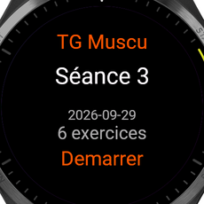
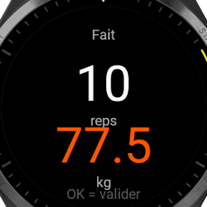
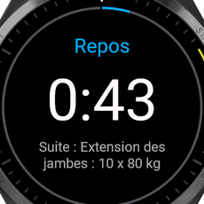

# Technogym (Mywellness) vers Garmin

Passerelle qui met le programme prescrit dans Mywellness (Technogym) sur une montre Garmin, avec deux
modes complementaires et un backend commun :

1. **Mode natif** : la seance du jour est convertie en workout structure Garmin (exercices, series,
   charges, repos) et poussee dans Garmin Connect chaque matin a 6h. La montre la suit nativement.
2. **Mode live** : une app Connect IQ ("TG Muscu") affiche la seance du jour, guide serie par serie
   (cible reps / charge, repos avec vibration, blocs cardio a duree), enregistre une activite FIT
   Strength et renvoie les series reellement faites au backend.

| | |
| --- | --- |
|  |  |
|  |  |

Captures du simulateur Connect IQ (Forerunner 965) branche sur le backend local et la vraie seance
Mywellness du 2026-09-29.

## Architecture

```
Mywellness (API privee)  <--  app/mywellness  -->  FastAPI (app/api)  -->  app/garmin  -->  Garmin Connect
   programme prescrit           client, cache        /workout/today          conversion         workout structure
   historique                   selection du jour    /workout/{id}/results   push + planif      (job 6h)
   ecriture (experimental)      writeback            /history, /auth/pair
                                                          ^
                                                          |  HTTPS via le telephone (BLE)
                                                     watch/ (Connect IQ, Monkey C)
```

* `app/mywellness/` : client HTTP (login `core.mywellness.com`, actions `services.mywellness.com`),
  modeles, service programme (seance du jour, cache, secours YAML), historique, writeback.
* `app/garmin/` : client `garminconnect`, mapping exercices (`exercise_map.json` valide contre le
  catalogue Garmin `garmin_exercises.json`), conversion, push + planification.
* `app/api/` : FastAPI + SQLite (tokens d'appairage, resultats de seance, journal des push).
* `app/jobs/` : APScheduler, push quotidien.
* `watch/` : app Connect IQ, scripts `build.sh`, `run-sim.sh`, `tools/fetch_devices.py`.
* `docs/` : `mywellness-api.md` (reco API), `connectiq.md` (compilation, simulateur, sideload),
  `limitations.md`, `garmin-push-capture.json` (reponse reelle du premier push).
* `DECISIONS.md` : journal des choix faits sans consultation.

## Installation du backend (local)

Prerequis : Python 3.11, `uv` (ou pip).

```
cd technogym-garmin
cp .env.example .env            # renseigner MYWELLNESS_* et GARMIN_*, choisir un ADMIN_TOKEN
uv venv .venv && . .venv/bin/activate
uv pip install -e ".[dev]"
python run.py                   # http://127.0.0.1:8000, docs Swagger sur /docs
```

Verifications :

```
curl -s localhost:8000/health
curl -s localhost:8000/workout/today -H "X-Admin-Token: $ADMIN_TOKEN" | python -m json.tool
PYTEST_DISABLE_PLUGIN_AUTOLOAD=1 pytest -q          # 20 tests sur des reponses Mywellness reelles anonymisees
python scripts/explore_mywellness.py                 # reconnaissance complete de l'API (sortie humaine)
```

Le premier appel Garmin fait un login complet (5 strategies, empreinte TLS tournante) puis persiste les
jetons dans `data/garmin_tokens.json`. Si le compte Garmin a la MFA, lancer une fois
`python -c "from app.api.main import build_state; from app.garmin.push import garmin_client; garmin_client(build_state()).api"`
en interactif pour saisir le code.

## Endpoints

| Methode | Route | Auth | Role |
| --- | --- | --- | --- |
| GET | `/health` | aucune | etat |
| POST | `/auth/pair` | `X-Admin-Token` | genere un token d'appairage pour la montre (`{"label": "fr965"}`) |
| GET | `/auth/pair` | admin | liste des tokens (tronques) |
| GET | `/workout/today` | pair ou admin | seance du jour au format simplifie (`?day=YYYY-MM-DD` optionnel) |
| GET | `/workout/all` | pair ou admin | toutes les seances du programme |
| GET | `/workout/{id}` | pair ou admin | une seance par id Mywellness |
| POST | `/workout/{id}/results` | pair ou admin | series reellement faites (montre -> backend) |
| GET | `/workout/{id}/results` | pair ou admin | resultats stockes |
| GET | `/history` | pair ou admin | historique Mywellness (`?days=30&limit=20&details=true`) |
| GET | `/history/{idCr}` | pair ou admin | une seance performee avec ses series |
| POST | `/garmin/push-today` | admin | conversion + push + planification du workout du jour |
| GET | `/garmin/last-push` | admin | dernier push enregistre |

Le token d'appairage se passe en en-tete `X-Pair-Token` ou en query `?token=`. Tant qu'aucun token
n'existe et qu'`ADMIN_TOKEN` est vide, les lectures sont ouvertes pour tester en local.

Format de `GET /workout/today` (champs nuls omis) :

```json
{ "id": "78a84e2e-...", "date": "2026-09-29", "name": "Séance 3", "program_name": "Programme d'entraînement",
  "exercises": [
    { "position": 3, "name": "Leg press Sel: Extension des jambes", "short_name": "Extension des jambes",
      "equipment": "Leg press Sel", "kind": "strength", "rep_duration_s": 3,
      "sets": [ { "reps": 10, "weight_kg": 80.0, "rest_s": 45 }, { "reps": 10, "weight_kg": 80.0, "rest_s": 45 } ] },
    { "position": 1, "name": "Bike: Exercice Personnalisé", "kind": "cardio",
      "sets": [ { "duration_s": 180, "power_w": 86.0 } ] }
  ] }
```

## Appairage de la montre

1. `curl -X POST localhost:8000/auth/pair -H "X-Admin-Token: $ADMIN_TOKEN" -H 'content-type: application/json' -d '{"label":"ma montre"}'`
2. Dans Garmin Connect Mobile : appareil > Applications Connect IQ > TG Muscu > Parametres :
   `backendUrl` (https) et `pairToken` (la valeur renvoyee).
3. Lancer l'app : la seance du jour s'affiche, START pour demarrer.

## Sideload de l'app sur la montre

Resume (details, prerequis SDK et simulateur dans `docs/connectiq.md`) :

```
.venv/bin/python watch/tools/fetch_devices.py     # appareils + polices Connect IQ (login Garmin du .env)
cd watch && ./build.sh --iq                       # bin/tgmuscu.iq (release, 64 appareils)
./build.sh -d fr965                               # ou un .prg pour votre modele
```

Copier le `.prg` de votre modele (ou le `.iq`) dans `GARMIN/Apps/` de la montre branchee en USB, puis
configurer les reglages via Garmin Connect Mobile. La montre exige du **https** pour le backend.

## Deploiement du backend

```
cp .env.example .env    # remplir
docker compose up -d --build
```

Le conteneur expose le port 8000 et lance le job APScheduler dans le meme processus : push du workout du
jour vers Garmin Connect tous les jours a `PUSH_HOUR` (6) dans le fuseau `TZ` (Europe/Paris). Donnees
persistantes dans `./data` (SQLite, jetons Garmin). Mettre un reverse proxy TLS devant (Caddy, Traefik,
Cloudflare Tunnel) : la montre refuse l'http. Le `docker build` n'a pas pu etre execute dans
l'environnement de cette session (pas de demon Docker) ; le Dockerfile est standard (`python:3.11-slim`).

Le push manuel reste disponible : `curl -X POST localhost:8000/garmin/push-today -H "X-Admin-Token: ..."`.
La reponse contient l'id du workout Garmin, l'URL `connect.garmin.com/modern/workout/<id>`, la
planification et le rapport de mapping par exercice. Premier push reel : `docs/garmin-push-capture.json`
(workout 1714662540 "TG Séance 3 2026-09-29", 24 steps, planifie le 2026-09-29).

## Mode live : parcours sur la montre

Accueil (seance du jour, cache si hors ligne) -> START -> pour chaque exercice : serie cible
`10 reps x 80 kg`, START = fait, saisie reps puis charge (UP / DOWN, START), repos 45 s avec vibration
-> serie suivante. Blocs cardio / etirements : compte a rebours de la duree cible. Appui long UP : menu
(annuler la derniere serie, passer l'exercice, liste des exercices, terminer, abandonner). Fin : resume,
START = sauvegarde FIT **puis** envoi des resultats ; en echec, mise en attente et renvoi automatique au
prochain lancement. Le `.prg` a ete teste dans le simulateur fr965 sur ce parcours complet (captures
dans `docs/screenshots/`).

## Ce qui a ete reellement execute dans cette session

* Login Mywellness, programme prescrit (3 seances, 27 exercices avec series / charges / repos),
  historique et derniere seance performee : `scripts/explore_mywellness.py`, fixtures dans `tests/fixtures/`.
* Backend local : `GET /workout/today` renvoie la vraie seance ; `POST /workout/{id}/results` depuis le
  simulateur ; 20 tests pytest verts.
* Garmin Connect : login, creation et planification du workout Strength du jour, relecture verifiee
  (categories, exercices, charges kg, groupes de repetitions, repos).
* Connect IQ : SDK 9.2.0 et 64 appareils installes en ligne de commande, `.prg` compiles pour 7 familles,
  `.iq` multi-appareils, parcours complet dans le simulateur fr965 avec le backend local.

## Prochaines etapes

1. Tester sur la vraie montre (modele a confirmer) : lisibilite, tactile, taille de reponse, HTTPS.
2. Activer `MYWELLNESS_WRITEBACK=1` sur une seance test et verifier dans l'app Mywellness le format
   attendu de `summaryData` ; ajuster `app/mywellness/writeback.py`.
3. Exposer le backend en https (Caddy + nom de domaine, ou Cloudflare Tunnel) et documenter l'URL dans
   les reglages de l'app.
4. Enrichir `exercise_map.json` au fil des programmes (le rapport de mapping du push signale les
   `fallback`), et ajouter les machines Technogym absentes.
5. Progression : proposer sur la montre la charge de la derniere seance reussie (donnees deja dans
   `/workout/{id}/results` et `/history`).
6. Glance / widget "seance du jour" et complication, publication eventuelle sur le store Connect IQ.
7. Ecouter les changements de programme (coach) pour re-pousser le workout Garmin dans la journee.

## Binaires prets a sideloader

`watch/dist/tgmuscu.iq` (tous les appareils) et `watch/dist/tgmuscu-<modele>.prg` (fr965, fr265, venu3,
vivoactive5, fenix7, epix2pro47mm, fenix843mm). Pour un autre modele : `cd watch && ./build.sh -d <id>`.
